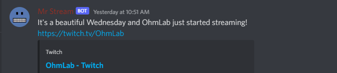
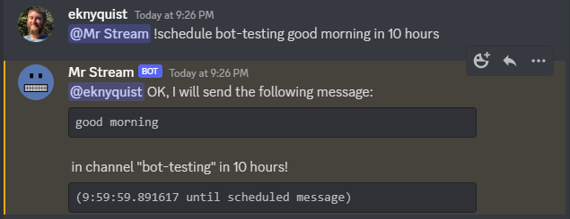
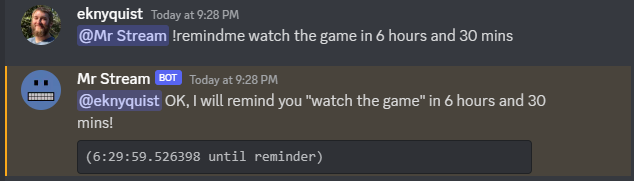
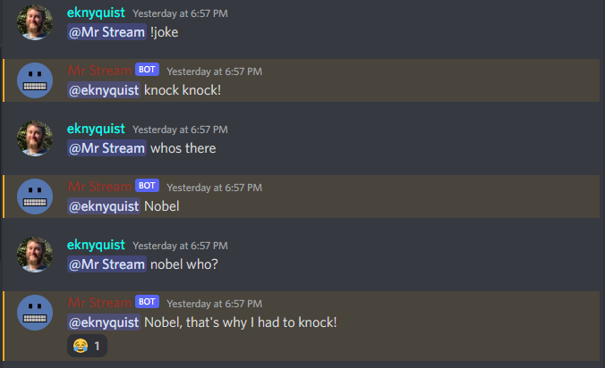
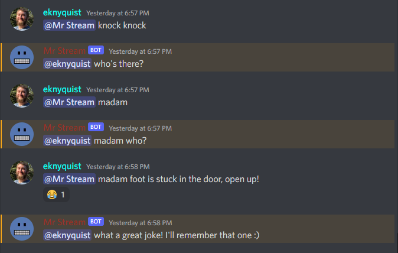
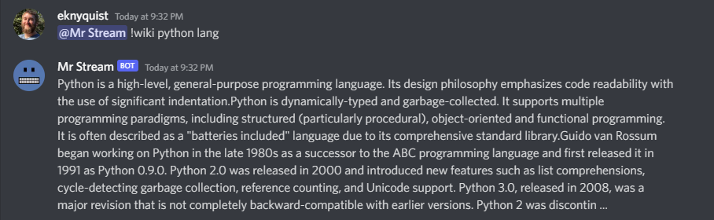
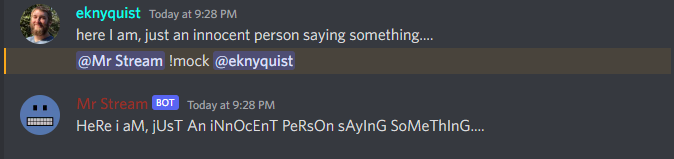

.. raw:: html

    

Nedry discord bot 2.2.0
=======================

(formerly "twitch_monitor_discord_bot")

Nedry is a self-hosted discord bot with a modular plugin system. Lots of useful
behaviour is available out-of-the-box, but you can also install plugins to extend
Nedry's behaviour, or even write your own plugins.

Some out-of-the-box features include:

* Stream announcements for twitch streamers (your own stream or any other streams)
* Scheduled DM reminders or public channel messages
* Tell knock-knock jokes (and remember jokes that you tell to it)
* Look something up on wikipedia for you (or provide a summary of a random wikipedia article)

.. contents:: **Table of Contents**

Limitations
===========

* Nedry currently does not support being invited to multiple discord servers at once--
  you must run one instance per discord server.

* Nedry is a self-hosted bot-- this means you have to run the python program
  yourself on a machine that you control, and configure it to connect specifically
  to your discord server.

Migrating from "twitch_monitor_discord_bot"
===========================================

The project name changed, but all the features that were present in "twitch_monitor_discord_bot"
are still present in "nedry". The following steps will be necessary to switch to "nedry":

* Un-install the "twitch_monitor_discord_bot" package, and install the "nedry" package
* Replace all "twitch_monitor_discord_bot" references to "nedry" (e.g. if you have a
  script or another program which runs the bot). Your existing bot configuration file for
  "twitch_monitor_discord_bot" will still work with nedry.

That's it!

Install
=======

Install for Python (only Python 3.9x or greater is supported) using ``pip``:

::

    python -m pip install nedry

Quick start
===========

Creating the config file and starting the bot
---------------------------------------------

#. Run the package as a module with no arguments, which will create an empty configuration
   file called ``default_bot_config.json`` in your current directory and exit immediately.

   ::

       $ python -m nedry

       Created default config file 'default_bot_config.json', please add required parameters

#. Most of the behaviours of this bot can be configured via discord messages while the
   bot is up and running, but there are a few parameters that need to be set in the configuration
   file first, to get the bot talking to twitch and to your discord server. Populate these required
   parameters in the .json file:

   #. ``discord_bot_api_token``: Discord bot API token must be entered here as a string.
      `Create a new bot application, and generate/copy token on the "Bot" page <https://discord.com/developers/applications>`_
      (NOTE: make sure to enable all Privileged Gateway Intents for your bot application).

   #. ``discord_server_id``: Discord server ID (the server that you want the bot to
      connect to) must be entered here as an integer.
      `How to find discord user/server/message IDs <https://support.discord.com/hc/en-us/articles/206346498-Where-can-I-find-my-User-Server-Message-ID->`_

   #. ``discord_admin_users``: A list of discord user IDs as integers may be  entered here.
      Admin users have access to the full set of discord commands that the bot can accept.
      At the very least, you'll probably want to add your own discord user ID here so that
      you have full control of the bot.
      `How to find discord user/server/message IDs <https://support.discord.com/hc/en-us/articles/206346498-Where-can-I-find-my-User-Server-Message-ID->`_

#. Once all required parameters have been set in the .json file, run the package as a module
   again, but this time pass your configuration file as an argument:

   ::

       $ python -m nedry default_bot_config.json

   If configured correctly, then the bot should now connect to your discord server. You're done editing the config file!

Further initial configuration: interacting with the bot on discord
------------------------------------------------------------------

Whenever your bot is online in the discord server, you can issue commands to the bot
by putting a mention of the bot's discord name at the beginning of the message, either
in a DM or in any channel the bot has access to, e.g. ``@BotName !command``. The only
command you *really* need to know is the ``help`` command;
if you say ``@BotName !help``, then the bot will show you what commands are available
and show you how to get more specific help with individual commands.

Aside from the first 3 things you set in the bot's configuration file in the previous section,
everything else about the bot's behaviour can be configured by sending messages/commands to
the bot on discord. One thing you might want configure in this way, is how twitch streamers
are monitored for stream announcements.

The following steps are required to enable twitch stream announcements:

#. **Setting which twitch streamers to monitor**

   Send the "addstreamers" command, with one or more arguments, each of which must
   be the name of an existing twitch channel. e.g. "@BotName !addstreamers channel1 channel2":

   .. image:: images/addstreamers.png

   Changes to the list of streamers are saved in the configuration file.

   For information about how to view the list of streamers being monitored, and how to
   remove a streamer from the list, use the "@BotName !help streamers" and "@BotName !help removestreamers"
   commands.

#. **Setting the discord channel for stream announcements**

   Send the "announcechannel" command with one argument, which should be the name of the discord
   channel you would like stream announcements to be sent to. e.g. "@BotName !announcechannel channel-name":

   .. image:: images/set_channel.png

   The stream announcement channel name is saved in the configuration file.

#. **Setting custom phrases for stream announcements**

   This is optional, but there is only 1 default stream announcement phrase, so
   you might want to add some of your own. Each time a streamer goes live, one
   of phrases is picked randomly for the announcement. Phrases may contain format tokens (see
   the "@BotName !help addphrase" command for more information about format tokens). e.g.
   "@BotName !addphrase some custom phrase":

   .. image:: images/add_phrase.png

   For reference, the phrase from the previous image produces the following stream announcement
   when a streamer named "OhmLab" starts streaming on a Wednesday:

   .. image:: images/stream_announcement.PNG

   All stream announcement phrases are saved in the configuration file.

#. **Setting twitch client ID and client secret**

   in a DM with the bot in discord, or in any public channel, send the "twitchclientid"
   command with two arguments, e.g. "@BotName !twitchclientid xxxx yyyy".

   Replace "xxxx" with your twitch client ID, and replace "yyyy" with  your twitch client
   secret. You must have a twitch account, and register an application, to obtain a
   client ID and client secret for your application. `instructions here <https://dev.twitch.tv/docs/authentication/register-app>`_.

   .. image:: images/set_twitchclientid.png

   You can change the client ID and client secret at any time, using the same command.
   The client ID and client secret you provide with this command is saved in the config file,
   so there is no need to re-send this every time you start the bot.

Running nedry as a systemctl service
====================================

Use the `nedry.service <https://raw.githubusercontent.com/eriknyquist/nedry/master/scripts/nedry.service>`__
file available on github to quickly create a systemctl service for running nedry.

NOTE: This service loads a config file at ``/home/ubuntu/nedry_config.json``, you may
need to edit the "ExecStart" line and change that path to your config file location.

NOTE: This service loads the environment of a user named "ubuntu", you may need to
edit the "User" line and change the username to your own username.

Writing and using plugins
=========================

* In order to use plugins, you must add at least one directory path to the ``plugin_directories``
  list in the configuration file. Plugins are installed by placing the python file(s) directly
  in the top level of any directory listed in ``plugin_directories`` (not in a subdirectory!).
  If any valid plugins exist in any the directories listed in ``plugin_directories`` when the
  bot starts up, they will be loaded and available for use.

* All loaded plugins are enabled by default. To see a list of all plugins, enabled and
  disabled, use the ``!plugins`` command. To disable/enable a plugin, use the
  ``!plugson`` and ``!plugsoff`` commands. For example, to disable the built-in
  ``knock_knock_jokes`` plugin, use ``@BotName !plugsoff knock_knock_jokes``.

* To get started with writing plugins, see `this sample plugin <https://github.com/eriknyquist/nedry/blob/nedry/example_plugins/echo_dm_example.py>`_.

  Also, see `this more complex built-in plugin <https://github.com/eriknyquist/nedry/blob/nedry/nedry/builtin_plugins/knock_knock_jokes.py>`_

Misc. sample bot interactions
=============================

The following are some screenshots of miscellaneous command / response interactions
with the bot in discord. This section is *not* intended as a comprehensive reference
of all available commands (see the "Bot command reference" section at the end for that),
but rather a quick illustration of what it looks like to interact with the bot in discord.

Announcements for when a twitch streamer goes live
--------------------------------------------------

Scheduling a message in a public channel
----------------------------------------

Scheduling a DM reminder
------------------------

Requesting a knock-knock joke from the bot
------------------------------------------

Telling a knock-knock joke for the bot to remember
--------------------------------------------------

Asking the bot to do a wikipedia search
---------------------------------------

Asking the bot to make fun of the last thing someone said
---------------------------------------------------------

Configuration file details
==========================

This section covers all configuration file parameters, including those not covered
in the Quick Start section. The configuration file must be a .json file of the following form:

::

    {
        "twitch_client_id": "xxxxxxxxxxxxxxxxxxxxxxxxxxxxxx",
        "twitch_client_secret": "xxxxxxxxxxxxxxxxxxxxxxxxxxxxxx",
        "discord_bot_api_token": "xxxxxxxxxxxxxxxxxxxxxxxxxxxxxxxxxxxxxxxxxxxxxxxxxxxxxxxxxxx",
        "discord_server_id": 123456789123456789,
        "discord_channel_name": "my-discord-channel",
        "poll_period_seconds": 60,
        "host_streamer": "my-twitch-streamer-name",
        "silent_when_host_streaming": true,
        "plugin_directories" : ["/home/user/nedry_plugins"],
        "discord_admin_users" : [422222187366187010, 487222187346187011],
        "discord_joke_tellers" : [422222187366187010, 487222187346187011],
        "jokes": [],
        "timezones": {},
        "command_log_file" : "/home/user/twitch_monitor_bot_command_log.txt",
        "startup_message": "Hello! I am a bot who can monitor twitch streams for you.",
        "streamers_to_monitor": [
            "mrsketi",
            "none_of_many"
        ],
        "stream_start_messages": [
            "{streamer_name} is now streaming! watch it here: {stream_url}",
            "{streamer_name} is doing something, go see it here: {stream_url}"
        ]
    }

Description of fields
---------------------

* ``twitch_client_id``: Enter your Twitch client ID here.

* ``discord_bot_api_token``: Enter the API token for your discord bot application here.

* ``discord_server_id``: Enter the server ID for the server you want the bot to connect to here.

* ``discord_channel_name``: Enter the name of the channel you want the bot to connect to here.

* ``poll_period_seconds``: Enter the desired delay (in seconds) between checking if all streamers are live here.

* ``host_streamer``: Enter the name of your own twitch channel here (optional).

* ``silent_when_host_streaming``: If true, no announcements about other streams will be made when host streamer is live.

* ``plugin_directories``: List of directory names to search for plugins to load on startup

* ``discord_admin_users``: Multiple discord user ID numbers can be added here. Users added
  here will be allowed to configure the bot by sending commands in discord.

* ``discord_joke_tellers``: Multiple discord user ID numbers can be added here. Any knock-knock
  jokes told to the bot by discord users in this list, will be "remembered" (stored in the "jokes"
  list), and can be told back to other discord users later when a joke is requested.

* ``jokes``: Any jokes remembered by the bot from discord users will be stored here.

* ``timezones``: Dict that maps discord user ID numbers to the IANA name of the timezone they are in.
  When you tell the bot your timezone with the "timezone" command, this is where it is stored.

* ``command_log_file``: Enter desired filename to log commands received from discord messages.
  Set to "null" if you don't want to log commands.

* ``startup_message``: Enter the message you would like the bot to send when it comes online after being started up here.
  Message may contain the following format tokens:

  * ``{botname}`` : replaced with bot name that is seen by other discord users
  * ``{date}`` : will be replaced with current date in DD/MM/YYY format
  * ``{times}`` : will be replaced with current time in HH:MM:SS format
  * ``{time}`` : will be replaced with current time in HH:MM format
  * ``{day}`` : will be replaced with the name of the current weekday (e.g. "Monday")
  * ``{month}`` : will be replaced with the name of the current month (e.g. "January")
  * ``{year}`` : will be replaced with the current year (e.g. "2022")

* ``streamers_to_monitor``: Enter the list of streamer names to monitor here.

* ``stream_start_messages``: Multiple messages can be defined here to be used as announcements
  for streamers going live. Messages may contain the following format tokens:

  * ``{streamer_name}`` : will be replaced with the name of the streamer
  * ``{stream_url}`` : will be replaced with the stream URL on twitch.com
  * ``{botname}`` : replaced with bot name that is seen by other discord users
  * ``{date}`` : will be replaced with current date in DD/MM/YYY format
  * ``{times}`` : will be replaced with current time in HH:MM:SS format
  * ``{time}`` : will be replaced with current time in HH:MM format
  * ``{day}`` : will be replaced with the name of the current weekday (e.g. "Monday")
  * ``{month}`` : will be replaced with the name of the current month (e.g. "January")
  * ``{year}`` : will be replaced with the current year (e.g. "2022")

Event reference for plugins
===========================

If you are writing a plugin, you probably need to subscribe to some events (as shown
in `this example plugin <https://github.com/eriknyquist/nedry/blob/master/example_plugins/echo_dm_example.py>`_).
This section enumerates al available event types in ``nedry.event_types.events``, along
with their expected arguments and a brief description:

.. list-table:: nedry.event_types.EventType
   :widths: 30 30 30
   :header-rows: 1

   * - Event
     - Event arguments
     - Event description

   * - DISCORD_MESSAGE_RECEIVED
     - (message)

       "message" is the discord.py message object (see
       `discord.py docs <https://discordpy.readthedocs.io/en/stable/api.html#discord.Message>`__)
     - Emitted whenever any discord message is received, either in a public channel
       which the bot has access to, or in a DM with the bot.

   * - DISCORD_BOT_MENTION
     - (message, text_without_mention)

       "message" is the discord.py message object (see
       `discord.py docs <https://discordpy.readthedocs.io/en/stable/api.html#discord.Message>`__).
       "text_without_mention" is the message text with the bot mention stripped out.
     - Emitted whenever any discord message that starts with a mention of the bots
       discord name is received, either in a public channel which the bot has access
       to, or in a DM with the bot.

   * - NEW_DISCORD_MEMBER
     - (member)

       "member" is the discord.py User object of the member who joined
       (see `discord.py docs <https://discordpy.readthedocs.io/en/stable/api.html#discord.User>`__).
     - Emitted whenever a new user joins the discord server.

   * - DISCORD_CONNECTED
     - No arguments
     - Emmitted whenever the bot is connected to the configured discord server
       (this can take up to a few seconds after startup)

   * - TWITCH_STREAM_STARTED
     - (name, url)

       "name" is the Twitch name of the streamer who started streaming.
       "url" is the Twitch URL of the stream that started.
     - Emitted whenever one of the streamers configured for monitoring starts streaming.

   * - TWITCH_STREAM_ENDED
     - (name, url)

       "name" is the Twitch name of the streamer who stopped streaming.
       "url" is the Twitch URL of the stream that ended.
     - Emitted whenever one of the streamers configured for monitoring stops streaming.

   * - HOST_STREAM_STARTED
     - No arguments
     - Emitted when the configured host streamer starts streaming

   * - HOST_STREAM_ENDED
     - No arguments
     - Emitted when the configured host streamer stops streaming

Bot command reference
=====================

Command ``help``
----------------

::

   help [command]

   Shows helpful information about the given command. Replace [command] with the
   command you want help with.

   Example:

   @BotName !help wiki

   All discord users may use this command.

Command ``quote``
-----------------

::

   quote

   Displays a random famous quote

   Example:

   @BotName !quote

   All discord users may use this command.

Command ``timezone``
--------------------

::

   timezone [timezone_name]

   Set the timezone for the author of the discord message, allowing this
   discord user to provide/see dates and times in their local timezone.

   [timezone_name] should be replaced with the name of a timezone from the IANA
   time zone database, or some substring, e.g. "london" or "los angeles". If you
   live in a big city, then often just typing the name of the city here will be
   enough. If you are having issues, however, try selecting your region on
   this IANA timezone map, and using the country/city name that is shown in
   the drop-down selection box: https://kevalbhatt.github.io/timezone-picker

   Sending this command with no arguments will query the timezone currently
   assigned to the author of the discord message.

   Example:

   @BotName !timezone           # Query timezone setting for this discord user
   @BotName !timezone london    # Set timezone for this discord user to "Europe/London"

   All discord users may use this command.

Command ``streamers``
---------------------

::

   streamers

   Shows a list of streamers currently being monitored.

   Example:

   @BotName !streamers

   Only discord users registered in 'admin_users' in the bot config. file may use this command.

Command ``addstreamers``
------------------------

::

   addstreamers [name] ...

   Adds one or more new streamers to list of streamers being monitored. Replace
   [name] with the twitch name(s) of the streamer(s) you want to monitor.

   Example:

   @BotName !addstreamers streamer1 streamer2 streamer3

   Only discord users registered in 'admin_users' in the bot config. file may use this command.

Command ``removestreamers``
---------------------------

::

   removestreamers [name] ...

   Removes one or more streamers from the  list of streamers being monitored. Replace [name]
   with the twitch name(s) of the streamer(s) you want to remove.

   Example:

   @BotName !removestreamers streamer1 streamer2 streamer3

   Only discord users registered in 'admin_users' in the bot config. file may use this command.

Command ``clearallstreamers``
-----------------------------

::

   clearallstreamers

   Clears the list of streamers currently being monitored.

   Example:

   @BotName !clearallstreamers

   Only discord users registered in 'admin_users' in the bot config. file may use this command.

Command ``phrases``
-------------------

::

   phrases

   Shows a numbered list of phrases currently in use for stream announcements.

   Example:

   @BotName !phrases

   Only discord users registered in 'admin_users' in the bot config. file may use this command.

Command ``testphrases``
-----------------------

::

   testphrases

   Shows all phrases currently in use for stream announcements, with the format tokens
   populated, so you can see what they will look like when posted to the discord channel.

   Example:

   @BotName !testphrases

   Only discord users registered in 'admin_users' in the bot config. file may use this command.

Command ``addphrase``
---------------------

::

   addphrase [phrase]

   Adds a new phrase to be used for stream annnouncements. The following format
   tokens may be used within a phrase:

       {streamer_name} : replaced with the streamer's twitch name
       {stream_url}    : replaced with the stream URL on twitch.tv
       {botname}       : replaced with bot name that is seen by other discord users
       {date}          : replaced with current date in DD/MM/YYY format
       {times}         : replaced with current time in HH:MM:SS format
       {time}          : replaced with current time in HH:MM format
       {day}           : replaced with the name of the current weekday (e.g. "Monday")
       {month}         : replaced with the name of the current month (e.g. "January")
       {year}          : replaced with the current year (e.g. "2022")

   Example:

   @BotName !addphrase "{streamer_name} is now streaming at {stream_url}!"

   Only discord users registered in 'admin_users' in the bot config. file may use this command.

Command ``removephrases``
-------------------------

::

   removephrases [number] [number] ...

   Removes one or more phrases from the list of phrases being used for stream announcements.
   [number] must be replaced with the number for the desired phrase, as shown in the
   numbered list produced by the 'phrases' command. In other words, in order to remove
   a phrase, you must first look at the output of the "phrases" command to get the
   number of the phrase you want to remove.

   Example:

   @BotName !removephrases 3 4 5

   Only discord users registered in 'admin_users' in the bot config. file may use this command.

Command ``nocompetition``
-------------------------

::

   nocompetition [enabled]

   [enabled] must be replaced with either 'true' or 'false'. If true, then no
   announcements about other streams will be made while the host streamer is streaming.
   If false, then announcements will always be made, even if the host streamer is streaming.

   (To check if nocompetition is enabled, run the command with no true/false argument)

   Examples:

   @BotName !nocompetition true     (enable nocompetition)
   @BotName !nocompetition false    (enable nocompetition)
   @BotName !nocompetition          (check current state)

   Only discord users registered in 'admin_users' in the bot config. file may use this command.

Command ``cmdhistory``
----------------------

::

   cmdhistory [entry_count]

   Show the last few entries in the command log file. If no count is given then the
   last 25 entries are shown.

   Examples:

   @BotName !cmdhistory     (show last 25 entries)
   @BotName !cmdhistory 5   (show last 5 entries)

   Only discord users registered in 'admin_users' in the bot config. file may use this command.

Command ``say``
---------------

::

   say [stuff to say]

   Causes the bot to send a message in the announcements channel, immediately, containing
   whatever you type in place of [stuff to say].

   Example:

   @BotName !say Good morning

   Only discord users registered in 'admin_users' in the bot config. file may use this command.

Command ``plugins``
-------------------

::

   plugins

   Show all loaded plugins, and show which ones are currently enabled

   Example:

   @BotName !help wiki

   Only discord users registered in 'admin_users' in the bot config. file may use this command.

Command ``plugson``
-------------------

::

   plugson [plugin_name] [plugin_name] ...

   Enable / turn on one or more plugins by name (plugin names can be seen in the
   output of the 'plugins' command, surrounded by square braces e.g. "[]").

   Example:

   @BotName !pluginon knock_knock_jokes other_plugin

   Only discord users registered in 'admin_users' in the bot config. file may use this command.

Command ``plugsoff``
--------------------

::

   plugsoff [plugin_name] [plugin_name] ...

   Disable / turn off one or more plugins by name (plugin names can be seen in the
   output of the 'plugins' command, surrounded by square braces e.g. "[]").

   Example:

   @BotName !pluginoff knock_knock_jokes other_plugin

   Only discord users registered in 'admin_users' in the bot config. file may use this command.

Command ``pluginfo``
--------------------

::

   pluginfo [plugin_name]

   Query information about a loaded plugin.

   Example:

   @BotName !pluginfo knock_knock_jokes

   Only discord users registered in 'admin_users' in the bot config. file may use this command.

Command ``twitchclientid``
--------------------------

::

   twitchclientid [client_id_string] [client_secret_string]

   Sets the client ID and client secret used to interact with the Twitch API.
   Replace [client_id_string] with the client ID string for your twitch application.
   Replace [client_secret_string] with the client secret string for your twitch application.

   Example:

   @BotName !help twitchclientid XXXXXXXXXXXX YYYYYYYYYYYY

   Only discord users registered in 'admin_users' in the bot config. file may use this command.

Command ``announcechannel``
---------------------------

::

   announcechannel [discord_channel_name]

   Sets the discord channel where stream announcements will be posted. If no discord
   channel name is provided, then the name of the current stream announcements channel
   will be returned.

   Example:

   @BotName !announcechannel                # Query current channel name
   @BotName !announcechannel my-channel     # Set announcements channel to 'my-channel'

   Only discord users registered in 'admin_users' in the bot config. file may use this command.

Command ``joke``
----------------

::

   joke

   Tells an interactive knock-knock joke.

   You can also *tell* knock-knock jokes to the bot, and it will remember new jokes
   to tell them back to you later when you send this command.

   Any discord users can tell jokes to the bot, but only jokes told by users listed
   in 'discord_joke_tellers' in the configuration file will be remembered.

   Example:

   @BotName !joke

   All discord users may use this command.

Command ``wiki``
----------------

::

   wiki [search text]

   Search the provided text using Wikipedia's public API, and return the summary text
   (generally the first paragraph) of the first page in the search results. If no search
   text is provided, then a random Wikipedia article will be selected instead.

   Examples:

   @BotName !wiki python language   (Show summary of wiki page for Python programming language)
   @BotName !wiki                   (Show summary of a random wiki page)

   All discord users may use this command.

Command ``mock``
----------------

::

   mock [mention]

   Repeat the last thing said by a specific user in a "mocking" tone. Replace [mention]
   with a mention of the discord user you want to mock.

   Example:

   @BotName !mock @discord_user

   All discord users may use this command.

Command ``apologize``
---------------------

::

   apologize [mention]

   Apologize to a specific user for having mocked them. Replace [mention]
   with a mention of the discord user you want to apologize to.

   Example:

   @BotName !apologize @discord_user

   All discord users may use this command.

Command ``apologise``
---------------------

::

   apologise [mention]

   Apologize to a specific user for having mocked them. Replace [mention]
   with a mention of the discord user you want to apologize to.

   Example:

   @BotName !apologize @discord_user

   All discord users may use this command.

Command ``schedule``
--------------------

::

   schedule [channel_name] [message_text] in|on|at [time_description]

   Set up a message to be sent by the bot in a specific discord channel after a specific
   time delay.

   [channel_name] should be replaced with name of the discord channel in which you
   want the message to be sent.

   [message_text] should be replaced with whatever text you want to be sent in the discord message.

   [time_description] should be replaced with a description of the desired time before
   the message is delivered to the channel. The time can be described in one of the following ways:

   - An absolute delay period written in english, using digits (e.g. "5") instead of
     words (e.g. "five") for number values. For example: "1 minute", "2 hours and 3 minutes",
     "2hrs3mins", "2 hours & 3 minutes"

   - A specific date and time, written in one of the following formats:
     * DD/MM/YYYY HH:MM
     * YYYY/MM/DD HH:MM
     * HH:MM DD/MM/YYYY
     * HH:MM YYYY/MM/DD

   Sending the command with no arguments returns the list of currently scheduled messages.

   Examples:

   @BotName !schedule                                    # Query currently scheduled messages
   @BotName !schedule jokes haha! in 2 hours             # Schedule message to "jokes" in 2 hours
   @BotName !schedule news raining :( in 1h & 10m        # Schedule message to "news" in 1 hour, 10 mins
   @BotName !schedule general howdy! at 17:02 23/10/2025 # Schedule message to "general" at specific date & time

   Only discord users registered in 'admin_users' in the bot config. file may use this command.

Command ``unschedule``
----------------------

::

   unschedule [message_number] [message_number] ...
   unschedule all
   unschedule last

   Remove one or more scheduled messages by number. [message_number] should be replaced
   with the number of the message you want to remove, as shown by the output of running the
   '!schedule' command with no arguments.

   Alternatively, instead of passing numbers, you can pass a single argument of "all"
   to remove all scheduled messages at once, or "last" to remove the most recently
   added scheduled message.

   Examples:

   @BotName !unschedule last          # Remove last added message
   @BotName !unschedule all           # Remove all messages
   @BotName !unschedule 2             # Remove message #2
   @BotName !unschedule 5 6           # Remove messages 5 and 6

   Only discord users registered in 'admin_users' in the bot config. file may use this command.

Command ``remindme``
--------------------

::

   remindme [reminder_text] in|on|at [time_description]

   Set up a reminder. After the specified time, the bot will send you a DM with whatever
   text you provided for [reminder_text].

   [reminder_text] should be replaced with whatever text you want in the reminder message,
   e.g. the thing that you want to be reminded of.

   [time_description] should be replaced with a description of the desired time before
   the reminder is delivered. The time can be described in one of the following ways:

   - An absolute delay period written in english, using digits (e.g. "5") instead of
     words (e.g. "five") for number values. For example: "1 minute", "2 hours and 3 minutes",
     "2hrs3mins", "2 hours & 3 minutes"

   - A specific date and time, written in one of the following formats:
     * DD/MM/YYYY HH:MM
     * YYYY/MM/DD HH:MM
     * HH:MM DD/MM/YYYY
     * HH:MM YYYY/MM/DD

   Sending the command with no arguments returns the list of active reminders
   for the user that sent the command.

   Examples:

   @BotName !remindme                                           # Query current reminders for me
   @BotName !remindme To take out the trash... in 12 hours      # schedule reminder in 12 hours
   @BotName !remindme to take a shower :D in 1 day and 5 mins   # Schedule reminder in 1 day and 5 minutes
   @BotName !remindme to brush my teeth on 22/4/2025 14:30      # Schedule reminder at specific date & time

   All discord users may use this command.

Command ``unremind``
--------------------

::

   unremind [reminder_number] [reminder_number] ...
   unremind all
   unremind last

   Remove one or more reminders by number. [reminder_number] should be replaced with the
   number of the reminder you want to remove, as shown by the output of running the
   '!remindme' command with no arguments.

   Alternatively, instead of passing numbers, you can pass a single argument of "all"
   to remove all reminders at once, or "last" to remove the last reminder that you scheduled.

   Examples:

   @BotName !unremind last          # Remove last added reminder
   @BotName !unremind all           # Remove all reminders
   @BotName !unremind 2             # Remove reminder #2
   @BotName !unremind 5 6           # Remove reminders 5 and 6

   All discord users may use this command.

